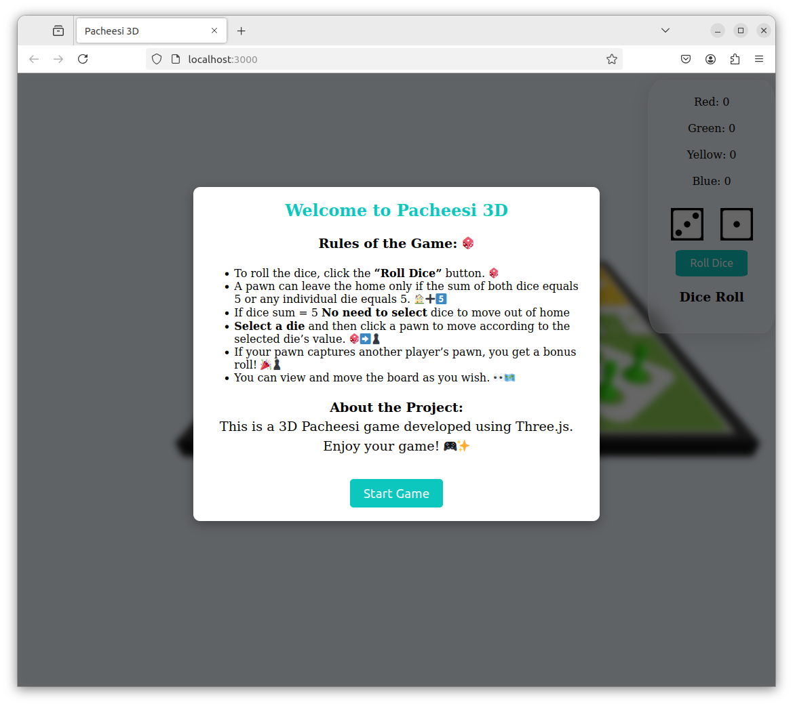

# Pacheesi Game

## About

Pachisi is a classic Indian board game, often called the “national game of India.” 🎲 It involves moving pieces around a cross-shaped board based on dice rolls, with the ultimate goal of getting all your pieces to the center home area before your opponents do. 

The game allows players to capture each other’s pieces, adding a strategic twist, while safe spaces on the board protect pawns from being captured. The game is deeply rooted in Indian culture, even being mentioned in the ancient Indian epic, the Mahabharata 📜. Pachisi has inspired modern games like **Parcheesi** and **Ludo**, which have spread worldwide 🌍.

Whether played casually or competitively, Pachisi remains a beloved game that brings people together! 😊

---

## Features

- 🎲 **Roll Dice**: Click the "Roll Dice" button to roll the dice.
- 🏠 **Pawn Start**: A pawn can only leave the start position if the sum of both dice equals 5, or any individual die shows a value of 5.
- ➡️ **Move Pawns**: Select a die and then click a pawn to move according to the die's value.
- 🎉 **Bonus Rolls**: If you capture another player’s pawn, you get a bonus roll.
- 🛡️ **Safe Spaces**: Pawns on safe spaces cannot be captured.
- 💥 **Capturing Pawns**: Land on an opponent's pawn and capture it (except for pawns in the start position).
- 🏆 **Objective**: The first player to move all four pawns to the destination home wins!

---

## Installation

To run the game locally, follow these steps:

1. **Clone the Repository**  
   Clone this repository to your local machine:

   ```bash

   git clone https://github.com/shubham-0927/pacheesi-game.git
   ```

2. **Install Dependencies**  

```bash
   npm install
   npm install express
   ```

3. **Run the Game**  
   Start the application:

```bash
   node app.js
   ```

   The game will be accessible at [localhost:3000](http://localhost:3000).

---

## Screenshots

Here are some screenshots from the game:

- 
- 
- 
- 
- 

---

## Mouse Events

All mouse events (such as clicks and moves) will be logged in the `mouse-events.log` file for debugging and analysis.

---

## Game Rules Recap

### Basic Rules

- **Dice Roll**: The dice are rolled by clicking the "Roll Dice" button. The dice rolls dictate your move.
- **Moving Pawns**: Select one die value and click on your pawn to move it that number of spaces forward. You can move multiple pawns, but each one can only move based on the dice roll.
- **Capturing**: If your pawn lands on an opponent's pawn (except on the start position), you capture their pawn and send it back to the start. You also get an additional bonus roll.
- **Winning**: The first player to move all four of their pawns to the center "home" area wins!

### Bonus Features
- **Matching Dice**: When you roll matching dice (e.g., double 6), you receive a bonus throw.
- **Safe Spaces**: Certain spaces on the board are designated as safe, where pawns cannot be captured by opponents.

---

## Contributing

We welcome contributions! If you'd like to contribute to this project, please follow these steps:

1. Fork the repository.
2. Create a new branch (`git checkout -b feature-name`).
3. Make your changes and commit them (`git commit -am 'Add new feature'`).
4. Push to your branch (`git push origin feature-name`).
5. Create a new Pull Request.

---

## License

This project is licensed under the MIT License - see the [LICENSE](LICENSE) file for details.

---

## Acknowledgments

- Thanks to the contributors of the original **Pachisi** game for inspiring this digital version.
- Special thanks to the developers of libraries used in the project (e.g., Express).
